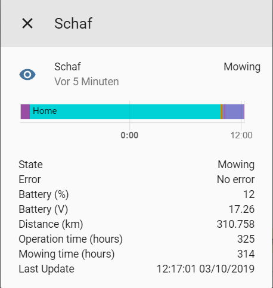
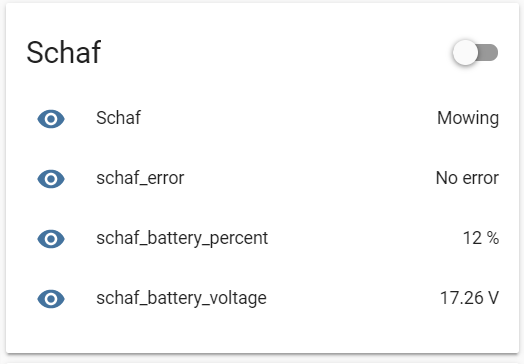

# Landroid Worx Cloud Sensor

This is a minimum implementation of an integration providing a sensor measurement.

## Installation

Copy this folder to `<config_dir>/custom_components/worxlandroidcloud/`.

Add the following to your `configuration.yaml` file:

**Important: The Mower will get the name which you configured for example in the Landroid app.**

```yaml
# Example configuration.yaml entry
sensor:
  - platform: worxlandroidcloud
    username: <username>
    password: <password>

# Example Templates to extract some values
# Note that my mower is named "schaf". If your mower has a different
# name, you have to use the name you gave to the mower for example in
# the Landroid app 
  - platform: template
    sensors:
      schaf_error:
        value_template: "{{ state_attr('sensor.schaf', 'Error') }}"
      schaf_battery_percent:
        value_template: "{{ state_attr('sensor.schaf', 'Battery (%)') }}"
        unit_of_measurement: "%"
      schaf_battery_voltage:
        value_template: "{{ state_attr('sensor.schaf', 'Battery (V)') }}"
        unit_of_measurement: "V"
```

### Examples how it looks like once integrated
Panel once you open the mower status:



Examples with templates from example above:



## Using Services

The following services are available:
- worxlandroidcloud.home
- worxlandroidcloud.start
- worxlandroidcloud.stop
